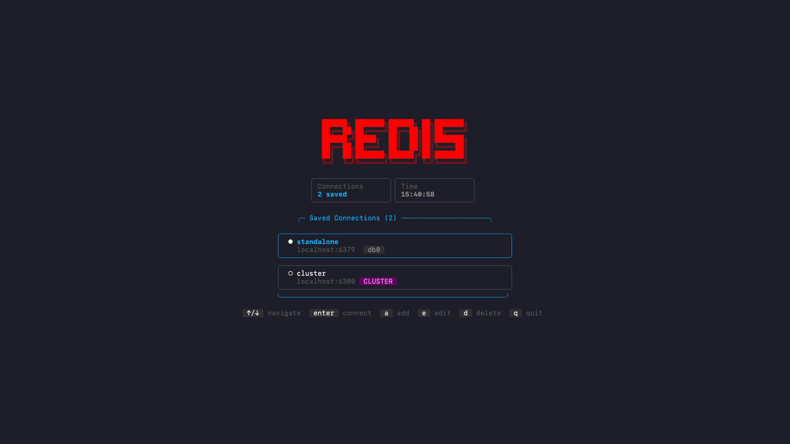

# Redis TUI Manager

[](https://github.com/davidbudnick/redis-tui/actions/workflows/ci.yml)
[](https://github.com/davidbudnick/redis-tui/actions/workflows/release.yml)
[](https://opensource.org/licenses/MIT)

A feature-rich terminal UI for managing Redis databases, built with Go and [Bubble Tea](https://github.com/charmbracelet/bubbletea). Browse, edit, and monitor your Redis keys without leaving the terminal.



## Quick Install

```bash
# Homebrew (macOS and Linux)
brew tap davidbudnick/homebrew-tap
brew install --cask redis-tui
```

## Screenshots
### Key Browser with Preview
```
┌──────────────────────────────────────┬───────────────────────────────────────┐
│ Keys - Production [1234]             │ Preview                               │
├──────────────────────────────────────┼───────────────────────────────────────┤
│ Filter: user:*                       │ ───────────────────────────────────── │
│                                      │                                       │
│  Key                Type     TTL     │ Key: user:1001                        │
│ ──────────────────────────────────── │                                       │
│▶ user:1001          string   ∞       │ Type: string                          │
│  user:1002          string   1h      │                                       │
│  user:1003:profile  hash     ∞       │ TTL: No expiry                        │
│  user:1004:sessions list     2h      │                                       │
│  user:1005:followers set     ∞       │ ───────────────────────────────────── │
│  user:1006:scores   zset     ∞       │                                       │
│  user:1007          string   30m     │ Value                                 │
│  user:1008:cart     hash     15m     │                                       │
│                                      │ {                                     │
│                                      │   "id": 1001,                         │
│ 1-8 of 1234 • l:more                 │   "name": "John Doe",                 │
│                                      │   "email": "john@example.com"         │
│                                      │ }                                     │
│                                      │                                       │
│ j/k:nav enter:view a:add d:del /:filter i:info q:back                        │
└──────────────────────────────────────────────────────────────────────────────┘
```

### Live Metrics Dashboard
```
                        📊 Live Metrics Dashboard
                        master (localhost:6379)
         ────────────────────────────────────────────────────────────

      Ops/sec:      0       Memory:   1.5 MB      Blocked:      0
      Clients:      3       Net In:   0.03 KB/s   Net Out:   2.36 KB/s
      Hit Rate: 100.0%      Expired:        1     Evicted:        0

         ────────────────────────────────────────────────────────────

                           Ops/sec  0.0 (max: 43.0)
     ▆▆▆▆▆▆▆▆▆▆▆▆███████████
     ███████████████████████
     ███████████████████████
     ███████████████████████
     ███████████████████████
     ███████████████████████           ▁▁▁▁▁▁▁▁▁▁▁▁▁▁▁▁▁▁▁▁▁▁
     ────────────────────────────────────────────────────────────────
                         Memory (MB)  1.5 (max: 1.5)
                █████████████████████████████████
                █████████████████████████████████
                █████████████████████████████████
                █████████████████████████████████
     ████████████████████████████████████████████           █████████
     ████████████████████████████████████████████           █████████
     ────────────────────────────────────────────────────────────────
                         Network KB/s  2.4 (max: 6.0)
             ███████████
             ███████████
             ███████████
     ▆▆▆▆▆▆▆▆▆▆▆▆███████████
     ███████████████████████▁▁▁▁▁▁▁▁▁▁▁                 ▁▁▁▁▁▁▁▁▁▁▁
     ────────────────────────────────────────────────────────────────

                    Auto-refreshing • c:clear • q/esc:back
```

## Features

### Browsing and Editing
- **Key browser** with pattern filtering, regex, and fuzzy search
- **All data types** — strings, lists, sets, sorted sets, hashes, and streams
- **Inline editing** with VIM keybindings for strings and collections
- **Tree view** for hierarchical key navigation
- **Favorites and recent keys** for quick access
- **Key templates** for creating keys from predefined structures
- **Value history** — view and restore previous values
- **JSON syntax highlighting** and JSON path queries

### Connections and Security
- **Connection manager** — save and switch between multiple Redis instances
- **TLS/SSL** encryption support
- **SSH tunneling** for secure remote access
- **Connection groups** to organize instances
- **Database switching** between Redis databases (0-15)

### Monitoring and Operations
- **Live metrics dashboard** — real-time ops/sec, memory, and network I/O with ASCII charts
- **Server info, memory stats, slow log, and client list**
- **Cluster support** — view cluster node information
- **Watch mode** — monitor key values for changes in real-time
- **Keyspace events** — subscribe to keyspace notifications
- **Export/Import** — JSON-based key backup and restore
- **Bulk operations** — pattern-based delete and batch TTL
- **Pub/Sub and Lua scripting**

## Installation

### Homebrew

See [Quick Install](#quick-install) above.

### From Source

```bash
# Clone the repository
git clone https://github.com/davidbudnick/redis-tui.git
cd redis-tui

# Build
make build

# Install to GOPATH/bin
make install
```

### Using Go Install

```bash
go install github.com/davidbudnick/redis-tui@latest
```

### Pre-built Binaries

Download the latest release from the [Releases](https://github.com/davidbudnick/redis-tui/releases) page.

## Usage

```bash
redis-tui
```

Press `?` inside the app to view the full help screen. No CLI flags — all configuration is done through the [config file](#configuration) and the in-app connection manager.

### Uninstall

```bash
# Homebrew
brew uninstall --cask redis-tui
```

<details>
<summary>Keyboard Shortcuts</summary>

### Global

| Key | Action |
| --- | --- |
| `q` | Quit / Go back |
| `?` | Show help |
| `j/k` | Navigate up/down |
| `Ctrl+U/D` | Page up/down |
| `g/G` | Go to top/bottom |
| `home/end` | Go to top/bottom |
| `Ctrl+C` | Force quit |

### Connections Screen

| Key | Action |
| --- | --- |
| `Enter` | Connect to selected |
| `a/n` | Add new connection |
| `e` | Edit connection |
| `d/delete/backspace` | Delete connection |
| `r` | Refresh list |
| `Ctrl+T` | Test connection |

### Keys Screen

| Key | Action |
| --- | --- |
| `Enter` | View key details |
| `a/n` | Add new key |
| `d/delete/backspace` | Delete key |
| `r` | Refresh keys |
| `l` | Load more keys |
| `/` | Filter by pattern |
| `s/S` | Sort / Toggle direction |
| `v` | Search by value |
| `e` | Export to JSON |
| `I` | Import from JSON |
| `i` | Server info |
| `D` | Switch database |
| `f` | Flush database |
| `p` | Pub/Sub publish |
| `L` | View slow log |
| `E` | Execute Lua script |
| `O` | View logs |
| `B` | Bulk delete |
| `T` | Batch set TTL |
| `F` | View favorites |
| `W` | Tree view |
| `Ctrl+R` | Regex search |
| `Ctrl+F` | Fuzzy search |
| `Ctrl+H` | Recent keys |
| `Ctrl+L` | Client list |
| `Ctrl+E` | Toggle keyspace events |
| `Ctrl+X` | View expiring keys |
| `m` | Live metrics dashboard |
| `M` | Memory stats |
| `C` | Cluster info |
| `K` | Compare keys |
| `P` | Key templates |

### Key Detail Screen

| Key | Action |
| --- | --- |
| `e` | Edit value (string) |
| `a` | Add to collection |
| `x` | Remove from collection |
| `t` | Set TTL |
| `R` | Rename key |
| `c` | Copy key |
| `d/delete` | Delete key |
| `r` | Refresh value |
| `f` | Toggle favorite |
| `w` | Watch for changes |
| `h` | View value history |
| `y` | Copy to clipboard |
| `J` | JSON path query |
| `j/k` | Navigate collection items |
| `esc/backspace` | Go back to keys list |

</details>

## Configuration

Configuration is stored in `~/.config/redis-tui/config.json`.

### Example Configuration

```json
{
  "connections": [
    {
      "id": 1,
      "name": "Local Redis",
      "host": "localhost",
      "port": 6379,
      "password": "",
      "db": 0,
      "use_tls": false
    }
  ],
  "tree_separator": ":",
  "max_recent_keys": 20,
  "max_value_history": 50,
  "watch_interval_ms": 1000
}
```

### Connection Options

| Option | Description |
| --- | --- |
| `name` | Display name for the connection |
| `host` | Redis server hostname or IP |
| `port` | Redis server port (default: 6379) |
| `password` | Redis password (optional) |
| `db` | Redis database number (0-15) |
| `use_tls` | Enable TLS/SSL connection |
| `ssh_host` | SSH tunnel hostname (optional) |
| `ssh_user` | SSH tunnel username (optional) |
| `ssh_key_path` | Path to SSH private key (optional) |

### Custom Keybindings

Keybindings can be customized in the configuration file under the `key_bindings` section. All navigation and action keys can be remapped to your preference.

## Requirements

- Go 1.21 or later (for building from source)
- A terminal that supports 256 colors
- Redis server 4.0 or later

## Supported Platforms

- macOS (Intel and Apple Silicon)
- Linux (amd64, arm64)
- Windows (amd64)

## Development

```bash
# Install development dependencies
make dev-deps

# Run tests
make test

# Run linter
make lint

# Format code
make fmt

# Build for all platforms
make build-all
```

## License

MIT License - see [LICENSE](LICENSE) for details.

## Contributing

Contributions are welcome! Please feel free to submit a Pull Request.

1. Fork the repository
2. Create your feature branch (`git checkout -b feature/amazing-feature`)
3. Commit your changes (`git commit -m 'Add some amazing feature'`)
4. Push to the branch (`git push origin feature/amazing-feature`)
5. Open a Pull Request

## Acknowledgments

- [Bubble Tea](https://github.com/charmbracelet/bubbletea) - TUI framework
- [Lip Gloss](https://github.com/charmbracelet/lipgloss) - Styling library
- [Bubbles](https://github.com/charmbracelet/bubbles) - TUI components
- [go-redis](https://github.com/redis/go-redis) - Redis client

## Keywords

redis, redis-cli, redis-client, redis-tui, redis-gui, redis-manager, terminal, tui, cli, go, golang, database, key-value, cache, devops, sysadmin
